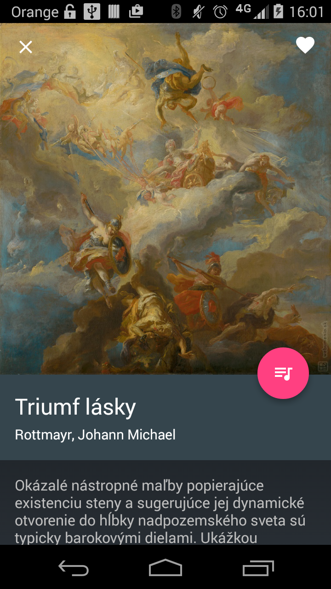

SNG Beacon
==========

Android application allowing visitors of museum to receive information about artwork just 
by coming near to exhibit with their phone (~2m). Solution is build with Estimote beacons 
and requires phone to have Bluetooth Low Energy (version 4.0) to function.

SNG Beacon is one of winning projects created during two days with help of Matej Hlavačka 
for SNG hackathon http://hackathon.sng.sk/

Additional Info
---------------

Project was built with Gradle inside Android Studio. Settings of home grid artworks can be
found inside HomeActivity.java, SNG API is not yet providing thumbnails for artwork pictures
that's why they are for now statically stored inside resources folder and hardcode linked in
home grid MyAdapter.  

App has built in beacon debug interface, to access it press top right overflow button in menu 
and select debug option. After selecting beacon you can change its MINOR (usefull when having 
limited number of beacons).

